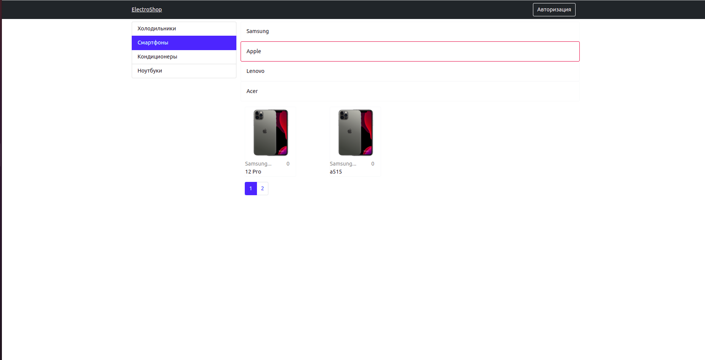
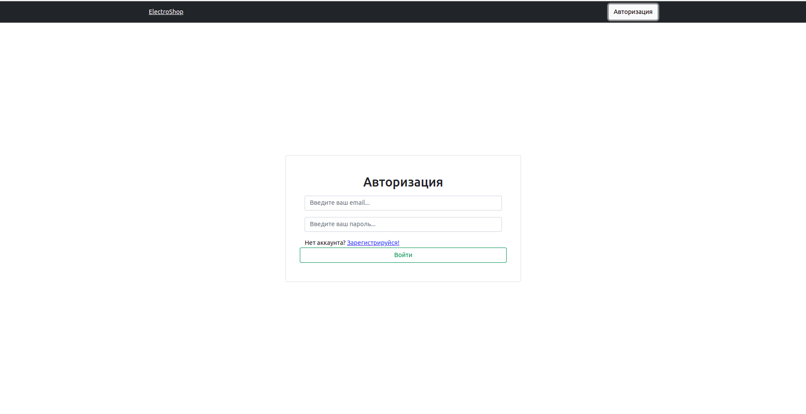

# Online-Store
### ElectroShop - это интернет магазин Электроники.
- Полностью реализовал серверную часть(вместе со всеми роутерами, регистрацией и авторизацией на JWT токенах)
- Мною полностью была реализована клиентаская часть при использовании таких технологии как React и MobX.

---
#### Please check how to launch the application below:

_Client_
* npm install;
* Launch frontend server with npm start;

_Server_
* npm install;
* Create file .env according to envsimple.txt
* Create DB;
* Execute npx sequelize db:migrate;
* Execute npx sequelize db:seed:all;
* Launch backend server with npm run dev;
